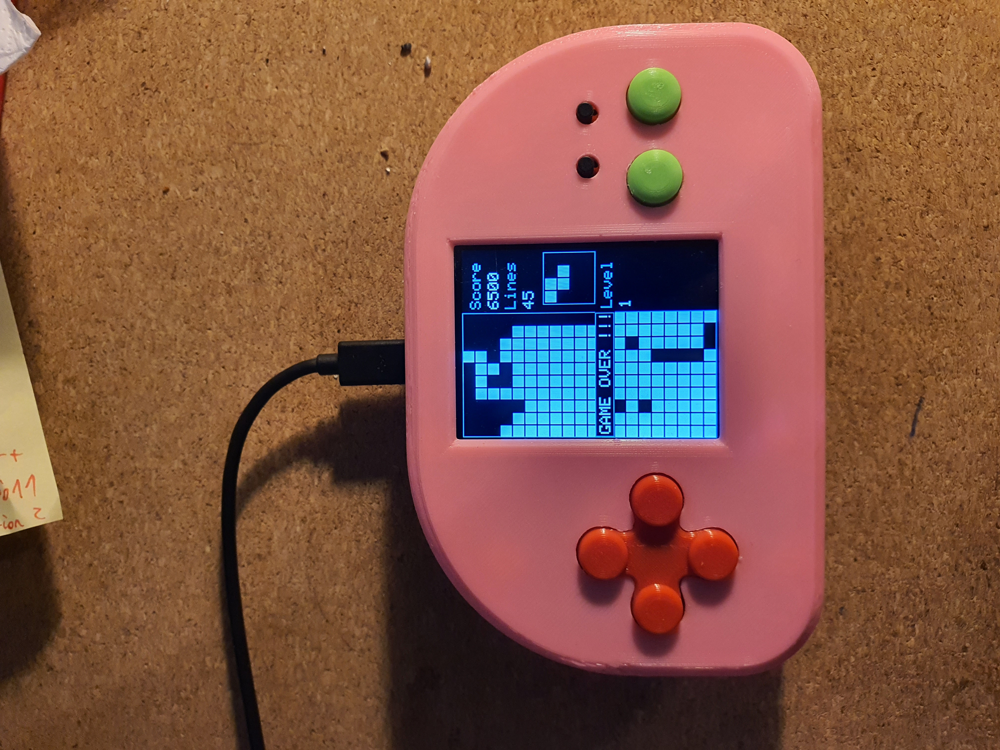

# AWGameBuddy
Open source DYI game console with complete models’ history and source code.
Current version utilizes ESP8266 microcontroller with 2.9-inch color display.
Communication is handled via SPI interface.
Buttons handling is done via the AD converter which measures voltage defined by the resulting resistance made by resistor and coupled buttons. Usually, it is required to tweak the threshold values within the software based on real life resistor values.
Repo contain 3D models for all the chassis parts.

All the parts before assembly

